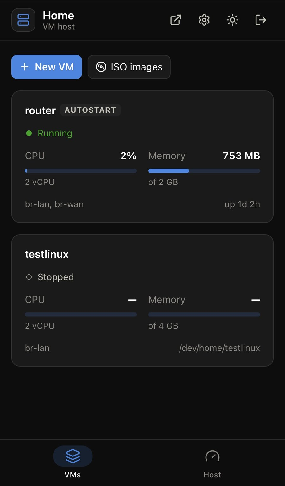
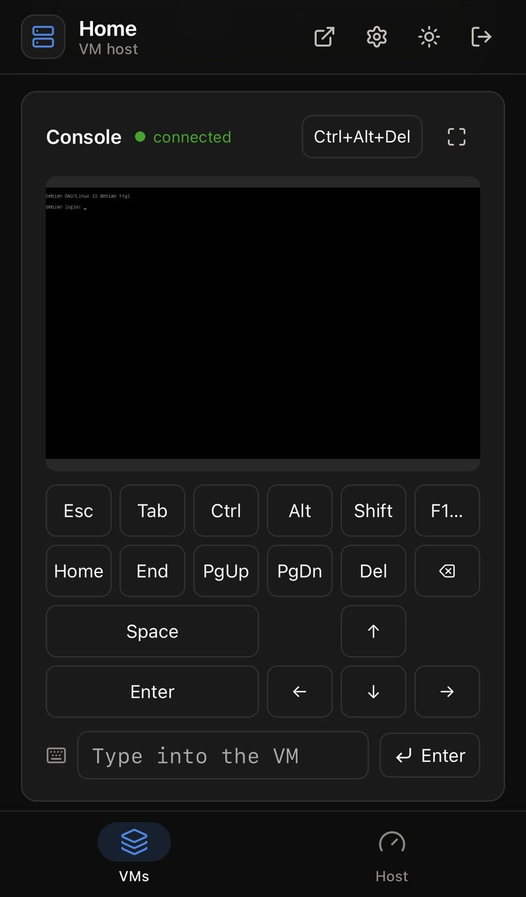
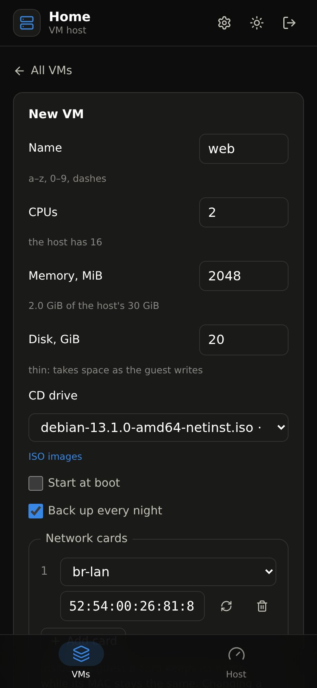
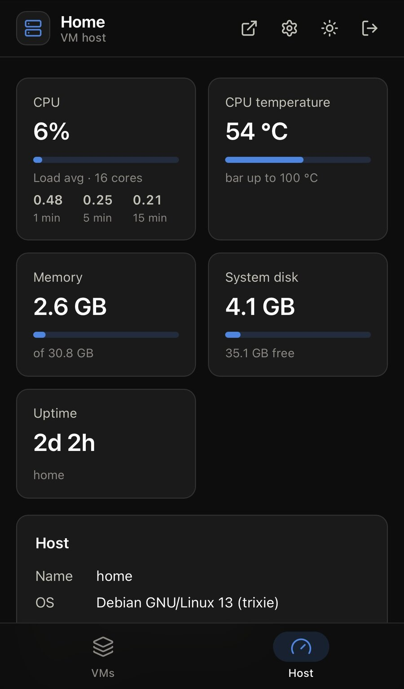

# home-ve

**A small self-hosted virtualization platform for one Debian machine.** It turns a plain Debian 13 box into a VM host
you run from the browser, on a computer or a phone: create and install VMs, watch and control them, back them up every night and keep an
encrypted copy off-site. No Proxmox, no custom kernel or distribution, and the web UI never runs as root.

<p align="center">
  
  
  
  
</p>

Made for a home server or a small office box: a router VM, Home Assistant, a NAS, a few Linux servers. One host runs
as many VMs as its CPU, memory and disks allow, and it grows by adding disks to the LVM pool or more memory.
(Managing several hosts together, as a cluster, is not a goal for now.)

## Why

- **Plain Debian underneath.** QEMU/KVM, LVM thin volumes, systemd and nginx: tools you already know. Each VM is one
  readable text file (`/etc/vm/<name>.conf`) and one systemd unit (`vm@<name>`). Everything the web UI does, you can
  also do from the shell, so it never locks you in.
- **Least privilege.** The backend runs as an unprivileged user. It may only start and stop `vm@…` units (through
  polkit) and write VM settings files. The root-side scripts parse those files, never execute them, and accept only
  thin volumes named after the VM as disks.
- **Any screen.** The whole UI works in a desktop browser and just as well on a phone, including the VM console
  (noVNC; on a phone, with a key panel for the keys its keyboard lacks).
- **Backups that don't stop the VM.** The guest's file systems are frozen for a moment (qemu-guest-agent), a thin
  snapshot is taken and compressed with zstd. Nightly, with retention (7 daily, 4 weekly); restore in one tap, with an
  undo snapshot. Optionally an encrypted offsite copy to Cloudflare R2, with limits so it can't run up a bill.
- **Installs and updates itself.** One idempotent `install.sh`; after that, updates are one button in the web UI.
- **Small.** A self-contained backend binary (no .NET on the host), a static frontend, no database: state lives in
  plain files.

## What it does

- host status: CPU, temperature, memory, disk;
- VMs: create (installation from an ISO through the console in the browser), start, shut down, reboot, power off,
  delete with or without the disk; cores, memory, network cards, CD drive, autostart; the VM's log; its IP addresses
  (from qemu-guest-agent in the guest);
- ISO images downloaded by the host from a URL;
- backups: nightly and on demand, restore, undo a restore;
- optional encrypted offsite copy of the backups (rclone to Cloudflare R2);
- self-update from the web UI.

Getting started: [docs/deployment.md](docs/deployment.md), from preparing the host to the first VM.

## How it works

```
browser ──► nginx on the host ─┬─► /var/www/home           frontend: static files (React)
                               └─► /api/ → 127.0.0.1:5000  backend: ASP.NET Core, API only
                                                ├─► /etc/vm/*.conf               VM settings (reads and writes)
                                                ├─► systemctl … vm@<name>        via polkit, only these units
                                                ├─► /run/vm-<name>/vnc.sock      console, WebSocket ⇄ VNC
                                                └─► /proc, /sys, journalctl      load, temperature, log

vm@<name>.service ──► vm-run <name> ──► qemu-system-x86_64     (root; validates the .conf itself, executes nothing from it)
```

The backend runs without root, does not listen on external interfaces, lets in only private networks (configurable), and only
after a password login. More in [docs/architecture.md](docs/architecture.md).

## Where things are

```
backend/
  HomeBackend/              backend (ASP.NET Core 10, minimal API)
    Program.cs              entry point: CLI command or web server
    Hosting/                what is registered and the order of the middleware
    Features/<Feature>/     Host, Vms, SystemStatus, Logs, Auth: data source (Linux and mock), models, endpoints
    Security/ Api/ Cli/ Configuration/ Infrastructure/   shared parts
  HomeBackend.Tests/        backend tests (xunit)
frontend/
  src/app/                  shell: header, routes, theme
  src/features/<page>/      vms, host, auth: the page, its API requests, components and styles
  src/shared/               HTTP client, usePoll, formatting, UI kit
  src/styles/               colors (tokens) and base styles
deploy/                     what the host pulls: binary, built frontend, units, scripts
  vm/                       vm-run, qmp, vm@.service, autostart, polkit rule
  nginx/                    nginx site (HTTPS, console over WebSocket)
docs/                       architecture, development, deployment
build.ps1 / build.sh        builds the frontend and the backend into deploy/
```

## Quick start (Windows)

You need the .NET 10 SDK and Node.js 22.

```powershell
dotnet run --project backend/HomeBackend --launch-profile "HomeBackend (mock)"   # API on :5080 with fake VMs, password admin
cd frontend; npm install; npm run dev                                           # http://localhost:5173 with hot reload
```

Tests and checks:

```powershell
dotnet test --solution backend/HomeBackend.slnx   # backend
cd frontend; npm run check                        # frontend: types, ESLint, Prettier, tests
```

## Deployment

```powershell
git commit -m "..."; git push                    # CI builds it; hosts download the build (docs/development.md)
```

On the host:

```bash
/opt/home-ve/deploy/update.sh
```

## Documentation

- [docs/architecture.md](docs/architecture.md): how the code is organized, the request path, permissions, the `.conf` format
- [docs/development.md](docs/development.md): running, tests, linters, conventions
- [docs/deployment.md](docs/deployment.md): preparing the host (CPU virtualization, the LVM thin pool, the network
  bridge), installation, your own domain and certificate, updates, settings, backups, offsite upload
- [deploy/README.md](deploy/README.md): cheat sheet for the host (the host only has `deploy/`)

## Security

Found a vulnerability? Please report it privately, see [SECURITY.md](SECURITY.md).

## License

The text in [LICENSE](LICENSE) is what applies: [PolyForm Noncommercial 1.0.0](https://polyformproject.org/licenses/noncommercial/1.0.0)
plus an additional permission on top of it. What follows is only a summary.

- **Free of charge:** at home, for hobby, study and research; for noncommercial, educational and government
  organizations; for an individual (including a freelancer or sole proprietor) for their own work. You may change
  and distribute it.
- **A commercial license is required:** for any company that makes money (including installing it on employees' work
  computers or on its own servers), and for anyone who makes money from the project itself: sells it, builds it into a
  product or device, offers it as a service, or installs it for clients for a fee. This follows from PolyForm
  Noncommercial itself: such use is commercial, and that license does not permit it. Contact the author via
  [GitHub](https://github.com/poltavetsvolodymyr).

Contributions from other people are accepted only with agreement to [CONTRIBUTING.md](CONTRIBUTING.md) (the checkbox in
the pull request template): the contributor keeps their rights, and the project may also be distributed under
commercial licenses.

Third-party components keep their own licenses: noVNC (MPL-2.0, unmodified, from the `@novnc/novnc` package,
source code at https://github.com/novnc/noVNC), React (MIT), lucide-react (ISC), .NET (MIT).
